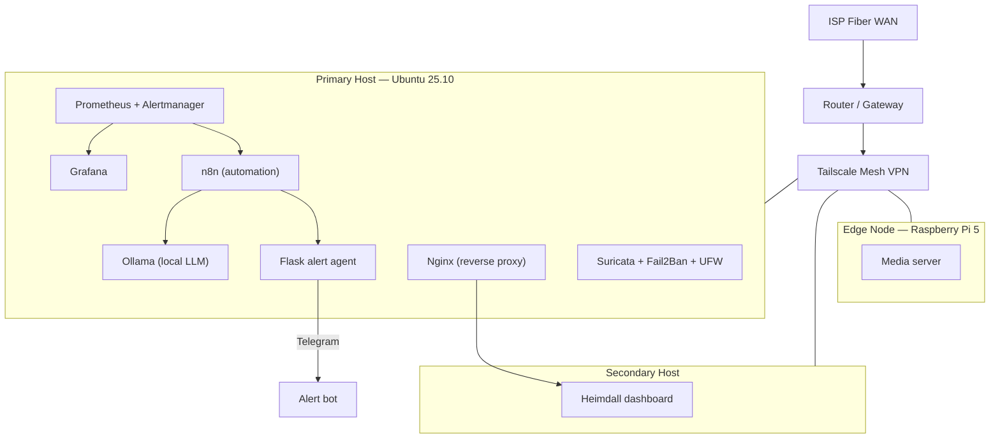

# The-Asylum — Self-Hosted Infrastructure Lab


A multi-host home infrastructure lab I designed, built, and operate solo — covering networking, observability, security, and automation. Built as hands-on preparation for a Cloud & Network Engineering career (WGU B.S. in progress), not a tutorial-follow-along.

This repo documents the real architecture, the real incidents I've diagnosed and fixed, and sanitized versions of the actual configs running the stack. IPs, tokens, and hostnames have been redacted or replaced with placeholders — the logic and structure are real.

---

## Architecture



All inbound access is scoped to the Tailscale interface — nothing in this stack is exposed to the public internet. See [`docs/stack-reference.md`](docs/stack-reference.md) for the full service inventory.

## Services at a Glance

| Layer | Tools | Purpose |
|---|---|---|
| Networking | Tailscale, Nginx, dnsmasq | Mesh VPN, reverse proxy, internal split-DNS (`*.internal` resolves only for VPN clients) |
| Security | Suricata, Fail2Ban, UFW | Intrusion detection, brute-force prevention, least-privilege port exposure |
| Observability | Prometheus, Grafana, Alertmanager, Node/Blackbox Exporter | Metrics collection, dashboards, alerting |
| Automation | n8n, Ollama (Llama 3.1) | Event-driven workflows; local LLM triages alerts before they reach a human |
| Containerization | Docker, Docker Compose | Service isolation and deployment |

## Problems I Solved

**Diagnosing an intermittent WAN outage without ISP cooperation.**
Recurring dropouts didn't correlate with any obvious cause. I wrote [`scripts/ping_correlate.py`](scripts/ping_correlate.py) to cross-reference ping logs from two independent hosts on the network (one wired, one WiFi) — if both hosts drop at the same moment, the fault is upstream (WAN); if only one drops, it's local (WiFi/wiring/extender). The data isolated the fault to the ISP-provided gateway itself, not the fiber line or in-home wiring. I used that evidence when working with ISP field techs, who verified the physical line was clean — confirming the gateway was the actual failure point. Replacing it resolved the issue, confirmed by a return to zero correlated outages in the next run. The script also writes its results out as Prometheus textfile metrics (`wifi_outage_count`, `wan_outage_count`), so the diagnosis feeds directly into the existing Grafana dashboards instead of living in a standalone report.

Once the WAN issue was resolved, isolated WiFi-only blips remained. [`scripts/ping_extender.sh`](scripts/ping_extender.sh) continuously pings the WiFi extender's own management IP in parallel, so those blips can be cross-referenced to tell backhaul (extender-to-router) issues apart from client-radio issues — the same "log two things, compare timestamps" approach applied one layer deeper.

**Fixing a boot-order race condition that was silently breaking services.**
After reboots, my reverse proxy and DNS resolver intermittently failed to bind to my VPN interface's IP — because `systemd` was starting them before the VPN client had actually finished assigning the interface an address. `After=`/`Wants=` ordering alone wasn't sufficient, since it only waits for the *unit* to report started, not for the *IP* to exist. Fixed with a short `ExecStartPre` delay in a systemd override — see [`configs/systemd/`](configs/systemd/).

**Building an alert pipeline that triages itself.**
Rather than getting paged for every disk-space blip, I run a local LLM (Ollama) inside an n8n workflow that reads incoming alerts, decides whether they're actionable, and only escalates the ones that matter to Telegram — cutting noise without losing signal.

## Roadmap

- [ ] Replace ISP-provided router/gateway with a dedicated OPNsense build (managed switch + Wi-Fi 6 APs) for full routing/firewall/VLAN control
- [ ] Migrate NAS storage to a dedicated TrueNAS SCALE box
- [ ] Deploy an open-source SIEM (Wazuh or ELK) on top of existing Suricata/Fail2Ban logs
- [ ] CCNA certification

## Repo Layout

```
.
├── README.md
├── docs/
│   └── stack-reference.md      # Full service inventory (sanitized)
├── configs/
│   └── systemd/                # Boot-order race condition fixes
├── scripts/
│   ├── ping_correlate.py       # WAN vs. local outage diagnostic tool
│   └── ping_extender.sh        # Extender-side vs. client-side WiFi diagnostic tool
└── n8n-workflows/
    └── README.md                # Workflow descriptions + design notes
```

---
*All IPs, hostnames, tokens, and credentials in this repo are placeholders or redacted. This is a documentation/portfolio repo, not a working deployment target.*
